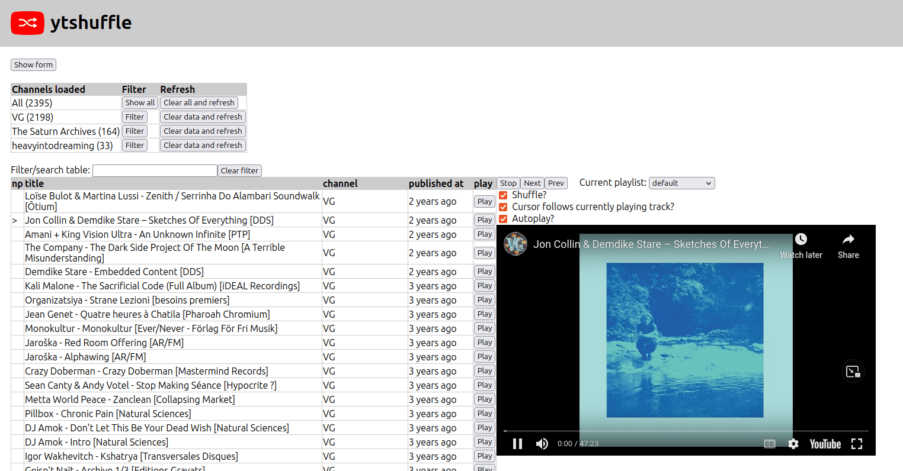

# ytshuffle

Designed to shuffle a channel of videos. Uses the youtube v3 API to fetch videos
for a channel associated with a particular video. At the time being, it is
easier to find channelID from a normal video link than an actual link to the
channel.

## Demo

https://cmdcolin.github.io/ytshuffle/

## Screenshot



## Dev

```
yarn dev
```

## Deploy

```
yarn deploy

```
